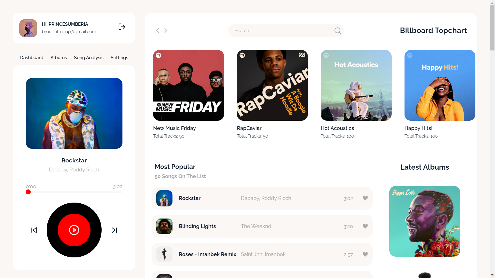

# Minimalist Spotify - Built With React

[](https://app.netlify.com/sites/minimalistspotify/deploys)

<p align='center'>

</p>

<p align="center">
  View <a href="https://minimalistspotify.netlify.app/">Minimalist Spotify</a>
</p>

## Project Setup

```
npm install
```

## Run Locally

```
npm start
```

## Contribute

Minimalist Spotify is an open source project. So, feel free to contribute. And if you're new to contributing to Open Source on Github, then [this guide](https://guides.github.com/activities/contributing-to-open-source/) will help you.

If you find any error or have any suggestion, feel free to create an [issue](https://github.com/PrinceSumberia/minimalist-spotify-react/issues/new).

## Credits

- Thanks, Spotify for the [API](https://developer.spotify.com/documentation/web-api/).
- Thanks, [Dribble](https://dribbble.com/) for the Design Inspiration.

## Support

<a href="https://www.buymeacoffee.com/princesumberia" target="_blank" rel="noopener noreferrer" ></a>
